# Flink Shop - 基于 Flink 的电商实时数据分析系统

## 📖 项目介绍

Flink Shop 是一个基于 Apache Flink 的电商实时数据分析系统，采用 Scala 语言开发。该系统从 Kafka 消息队列中实时消费电商用户行为数据，通过 Flink 流式计算引擎进行多维度统计分析，并将结果实时写入 MySQL 数据库，实现对商品销量、门店销售、用户行为等关键业务指标的实时监控与分析。

系统还包含完整的数据可视化模块，通过 Flask Web 应用和 ECharts 图表库，提供直观的实时数据看板，支持多维度数据展示和自动刷新。

### 核心功能

- **商品销量统计**：实时统计各商品的购买次数，支持 Top10 热销商品排行
- **门店销售分析**：按门店维度统计销售额和访问量
- **用户行为分析**：统计各类用户行为（浏览、购买等）的数量分布
- **每日销售汇总**：计算每日总销售额和总访问量
- **实时数据持久化**：所有统计结果实时写入 MySQL 数据库
- **数据可视化看板**：基于 Flask + ECharts 的实时数据大屏，支持自动刷新

### 技术架构

```

Flume（数据采集）→ Kafka (消息队列) → Flink (流式计算) → MySQL (数据存储) → Flask API (数据服务) → ECharts (数据可视化)
```
---

## 📁 项目结构及文件说明

### 项目目录结构

```

flink_shop/
├── src/main/
│   ├── scala/
│   │   ├── flinkclass/          # 主程序入口（Flink 作业）
│   │   │   ├── BehaviorCountToMySQL.scala    # 用户行为统计作业
│   │   │   ├── GoodsOrder.scala              # 商品订单 Top10 统计作业
│   │   │   ├── GoodsSaleToMySQL.scala        # 商品销量统计作业
│   │   │   ├── SaleVolumn.scala              # 销售额与访问量统计作业
│   │   │   ├── StoreSale.scala               # 门店销售统计作业
│   │   │   └── StoreVisitToMySQL.scala       # 门店访问统计作业
│   │   ├── mysqlsink/           # MySQL 数据 Sink 连接器
│   │   │   ├── BehaviorSQLSink.scala         # 行为数据写入器
│   │   │   ├── GoodsSQLSink.scala            # 商品数据写入器
│   │   │   ├── SaleSQLSink.scala             # 销售数据写入器
│   │   │   ├── StoreSQLSink.scala            # 门店数据写入器
│   │   │   └── StoreVisitSQLSink.scala       # 门店访问数据写入器
│   │   └── objectclass/         # 数据模型类
│   │       ├── StringAndDouble.scala         # 日期-数值通用模型
│   │       ├── date_behavior_count.scala     # 行为统计数据模型
│   │       ├── date_goods_sale.scala         # 商品销售数据模型
│   │       ├── date_store_sale.scala         # 门店销售数据模型
│   │       └── date_store_visit.scala        # 门店访问数据模型
│   ├── data.py                  # 模拟数据生成器
│   ├── app.py                   # Flask Web API 服务
│   └── index.html               # 数据可视化前端页面
├── pom.xml                      # Maven 配置文件
└── README.md                    # 项目说明文档
└── spool-memory-kafka.conf      # Flume 配置文件
```
### 文件详细说明

#### 1. 主程序模块 (`scala/flinkclass/`)

**BehaviorCountToMySQL.scala**
- **功能**：统计每种用户行为类型的数量（如浏览、购买、收藏等）
- **输入**：Kafka `shop` topic 中的原始数据
- **输出**：MySQL `behavior_count` 表
- **时间窗口**：1 分钟滚动窗口
- **数据格式**：(日期, 行为类型, 数量)

**GoodsOrder.scala**
- **功能**：统计商品销量 Top10 排行榜
- **输入**：Kafka `shop` topic 中的购买行为数据
- **输出**：控制台打印（可扩展为 MySQL 存储）
- **时间窗口**：1 分钟滚动窗口
- **特点**：使用 ProcessWindowFunction 进行复杂聚合和排序

**GoodsSaleToMySQL.scala**
- **功能**：统计每个商品的累计销量
- **输入**：Kafka `shop` topic 中的购买行为数据
- **输出**：MySQL `goods_sale` 表
- **时间窗口**：1 分钟滚动窗口
- **数据格式**：(日期, 商品ID, 销量)

**SaleVolumn.scala**
- **功能**：统计每日总销售额和总访问量
- **输入**：Kafka `shop` topic 中的所有数据
- **输出**：
  - MySQL `salevolume` 表（每日销售额）
  - MySQL `visitcount_everyday` 表（每日访问量）
- **时间窗口**：1 分钟滚动窗口
- **特点**：同时输出两个指标，购买行为计入销售额，所有行为计入访问量

**StoreSale.scala**
- **功能**：统计各门店的销售额
- **输入**：Kafka `shop` topic 中的购买行为数据
- **输出**：MySQL `store_sale` 表
- **时间窗口**：1 分钟滚动窗口
- **数据格式**：(日期, 门店ID, 销售额)

**StoreVisitToMySQL.scala**
- **功能**：统计各门店的访问量（所有行为都算访问）
- **输入**：Kafka `shop` topic 中的所有数据
- **输出**：MySQL `store_visit` 表
- **时间窗口**：1 分钟滚动窗口
- **数据格式**：(日期, 门店ID, 访问量)

#### 2. MySQL Sink 模块 (`scala/mysqlsink/`)

所有 Sink 类均继承自 `RichSinkFunction`，实现自定义数据库连接和数据写入逻辑。

**BehaviorSQLSink.scala**
- 写入用户行为统计数据
- 支持 upsert 操作（ON DUPLICATE KEY UPDATE）
- 目标表：`behavior_count`

**GoodsSQLSink.scala**
- 写入商品销量数据
- 支持 upsert 操作
- 目标表：`goods_sale`

**SaleSQLSink.scala**
- 写入销售额和访问量数据
- 根据表名动态选择更新字段
- 目标表：`salevolume` / `visitcount_everyday`

**StoreSQLSink.scala**
- 写入门店销售数据
- 目标表：`store_sale`

**StoreVisitSQLSink.scala**
- 写入门店访问数据
- 支持 upsert 操作
- 目标表：`store_visit`

#### 3. 数据模型模块 (`scala/objectclass/`)

**StringAndDouble.scala**
- 通用数据模型：(日期, 数值)
- 用于销售额、访问量等简单指标

**date_behavior_count.scala**
- 行为统计数据模型：(日期, 行为类型, 数量)

**date_goods_sale.scala**
- 商品销售数据模型：(日期, 商品ID, 销量)

**date_store_sale.scala**
- 门店销售数据模型：(日期, 门店ID, 销售额)

**date_store_visit.scala**
- 门店访问数据模型：(日期, 门店ID, 访问量)

#### 4. 数据可视化模块

**data.py** - 模拟数据生成器
- **功能**：生成符合电商场景的模拟用户行为数据
- **用途**：用于测试和演示，可替代真实 Flume 采集的数据
- **使用方法**：

  ```bash
  # python data.py <输出文件路径> <生成数据条数>
  # 示例：生成 1000 条数据
  python data.py /opt/flinkproject/test.log 1000
    ```

- **数据字段**（11个字段，CSV格式）：
  - RowKey（唯一标识）
  - 用户名
  - 年龄
  - 性别
  - 商品ID（11种商品）
  - 商品价格
  - 门店ID（12个门店）
  - 行为类型（pv【浏览】/cart【加购】/fav【收藏】/buy【购买】/scan【扫码】）
  - 电话号码
  - 邮箱
  - 购买日期（最近7天）

**app.py** - Flask Web API 服务
- **功能**：提供 RESTful API 接口，从 MySQL 查询数据并返回 JSON 格式
- **端口**：5000
- **主要接口**：
  - `GET /api/dashboard`：获取仪表盘全部数据
- **返回数据**：
  - 核心指标：总PV、总销售额、购买转化率、客单价
  - 趋势数据：近7天访问量与销售额
  - 行为占比：5种行为类型的百分比
  - 门店销售：各门店销售额排名
  - 商品Top10：销量最高的10个商品
  - 门店Top10：访问量最高的10个门店
  - 转化率分析：加购、收藏、购买转化率
- **依赖库**：Flask、Flask-CORS、PyMySQL

**index.html** - 数据可视化前端页面
- **功能**：基于 ECharts 的实时数据大屏
- **技术栈**：Bootstrap 5、Font Awesome 6、ECharts 5
- **主要组件**：
  - 4个核心指标卡片（PV、销售额、转化率、客单价）
  - 访问量与销售额双轴趋势图（近7天）
  - 用户行为占比饼图
  - 门店销售额柱状图
  - 商品销量Top10列表
  - 门店访问量Top10列表
  - 转化率对比图
- **特性**：
  - 每5秒自动刷新数据
  - 响应式设计，适配不同屏幕
  - 渐变色卡片和图标
  - 数据加载状态提示
  - 错误处理和重试机制
- **配置**：需修改 `BACKEND_URL` 为实际 Flask 服务地址

---

## 💻 技术栈及依赖版本

### 核心技术

- **开发语言**：Scala 2.12、Python 3.x
- **运行环境**：Java 8 (JDK 1.8)
- **构建工具**：Apache Maven 3.x
- **流处理引擎**：Apache Flink 1.10.1
- **Web 框架**：Flask 2.x
- **可视化库**：ECharts 5.4.3

### 主要依赖

| 依赖项 | 版本 | 说明 |
|--------|------|------|
| flink-streaming-scala_2.12 | 1.10.1 | Flink 流式计算核心库（Scala） |
| flink-clients_2.12 | 1.10.1 | Flink 客户端库 |
| flink-connector-kafka_2.12 | 1.10.1 | Flink Kafka 连接器 |
| mysql-connector-java | 8.0.26 | MySQL JDBC 驱动 |
| Flask | 2.x+ | Python Web 框架 |
| Flask-CORS | 3.x+ | 跨域支持 |
| PyMySQL | 1.x+ | MySQL Python 驱动 |

### 外部依赖软件

| 软件               | 版本要求    | 用途     |
|------------------|---------|--------|
| Apache Kafka     | 3.0.0   | 消息队列，数据源 |
| Apache ZooKeeper | 3.6.3   | Kafka 集群协调 |
| MySQL            | 8.0.42  | 数据存储   |
| JDK              | 1.8     | Java 运行环境 |
| Scala            | 2.12.15 | Scala 运行环境 |
| Flume            | 1.9.0   | 数据采集  |
| Python           | 3.13    | 数据可视化和模拟数据 |

---

## 🚀 项目部署及启动方式

### 前置条件

1. **安装并启动 Kafka 集群**
   - Kafka Broker 节点：`hadoop23020201:9092`, `hadoop23020202:9092`, `hadoop23020203:9092`
   - 创建 Topic：`shop`
```
bash
kafka-topics.sh --create --topic shop --bootstrap-server hadoop23020201:9092 --partitions 1 --replication-factor 1
```
2. **安装并启动 MySQL 数据库**

3. **创建数据库和数据表**

```
sql
-- 创建数据库
CREATE DATABASE fk_shop CHARACTER SET utf8mb4 COLLATE utf8mb4_unicode_ci;

USE fk_shop;

-- 商品销量表
CREATE TABLE goods_sale (
date VARCHAR(50) NOT NULL,
goods_id VARCHAR(50) NOT NULL,
sales DOUBLE,
PRIMARY KEY (date, goods_id)
);

-- 门店销售表
CREATE TABLE store_sale (
date VARCHAR(50) NOT NULL,
store_id VARCHAR(50) NOT NULL,
sale_amount DOUBLE,
PRIMARY KEY (date, store_id)
);

-- 门店访问表
CREATE TABLE store_visit (
date VARCHAR(50) NOT NULL,
store_id VARCHAR(50) NOT NULL,
visits DOUBLE,
PRIMARY KEY (date, store_id)
);

-- 行为统计表
CREATE TABLE behavior_count (
date VARCHAR(50) NOT NULL,
behavior_type VARCHAR(50) NOT NULL,
count DOUBLE,
PRIMARY KEY (date, behavior_type)
);

-- 每日销售额表
CREATE TABLE salevolume (
date VARCHAR(50) NOT NULL,
salevolume DOUBLE,
PRIMARY KEY (date)
);

-- 每日访问量表
CREATE TABLE visitcount_everyday (
date VARCHAR(50) NOT NULL,
visitcount DOUBLE,
PRIMARY KEY (date)
);
```
4. **安装 Python 依赖**（用于数据可视化模块）

```
bash
pip install flask flask-cors pymysql
```
5. **配置 hosts 文件**（如果 Kafka 集群域名无法解析）

编辑 `/etc/hosts`，添加：
```

<Kafka节点1_IP> hadoop23020201
<Kafka节点2_IP> hadoop23020202
<Kafka节点3_IP> hadoop23020203
```
### 编译打包

在项目根目录下执行：

```
bash
cd /data/flink_shop
mvn clean package
```
编译成功后，会在 `target/` 目录下生成 JAR 包：`flink_shop-1.0-SNAPSHOT.jar`

### 启动流程

#### 第一步：准备数据源（二选一）

**方式A：使用 Flume 采集真实数据**
```
bash
# 配置并启动 Flume Agent
/usr/local/flume/bin/flume-ng agent -c /usr/local/flume/conf/ -f /usr/local/flume/conf/spool-memory-kafka.conf -n client -Dflume.root.logger=INFO,console
```
**方式B：使用模拟数据生成器**
```
bash
# 生成 10000 条模拟数据
python src/main/data.py /opt/flinkproject/shop.log 10000

# 将数据发送到 Kafka（需要编写生产者脚本或使用 kafka-console-producer）
cat /opt/flinkproject/shop.log | kafka-console-producer.sh --broker-list hadoop23020201:9092 --topic shop
```
#### 第二步：启动 Flink 作业

根据不同业务需求，分别提交以下作业：

```
bash
# 1. 商品销量统计
flink run -c flinkclass.GoodsSaleToMySQL target/flink_shop-1.0-SNAPSHOT.jar

# 2. 商品订单 Top10
flink run -c flinkclass.GoodsOrder target/flink_shop-1.0-SNAPSHOT.jar

# 3. 门店销售统计
flink run -c flinkclass.StoreSale target/flink_shop-1.0-SNAPSHOT.jar

# 4. 门店访问统计
flink run -c flinkclass.StoreVisitToMySQL target/flink_shop-1.0-SNAPSHOT.jar

# 5. 用户行为统计
flink run -c flinkclass.BehaviorCountToMySQL target/flink_shop-1.0-SNAPSHOT.jar

# 6. 销售额与访问量统计
flink run -c flinkclass.SaleVolumn target/flink_shop-1.0-SNAPSHOT.jar
```
查看作业状态，访问 Flink Web UI：`http://<flink-master>:8081`

#### 第三步：启动数据可视化服务

1. **启动 Flask API 服务**

```
bash
cd /data/flink_shop/src/main
python app.py
```
服务将在 `http://0.0.0.0:5000` 启动

2. **打开数据可视化页面**

在浏览器中打开 `index.html` 文件，或直接访问：
```

file:///data/flink_shop/src/main/index.html
```
**重要**：修改 `index.html` 第 282 行的 `BACKEND_URL` 为你的实际 IP 地址：
```javascript
const BACKEND_URL = 'http://<你的虚拟机IP>:5000/api/dashboard';
```
3. **查看实时数据大屏**

  浏览器将显示完整的电商数据分析看板，数据每 5 秒自动刷新一次。

### 验证数据

启动作业后，可以通过以下方式验证数据是否正常写入：

1. **查看 Flink 日志**
```
bash
tail -f $FLINK_HOME/log/flink-*-taskexecutor-*.log
```
2. **查询 MySQL 数据**
```
sql
-- 查看商品销量
SELECT * FROM goods_sale ORDER BY sales DESC LIMIT 10;

-- 查看门店销售
SELECT * FROM store_sale ORDER BY sale_amount DESC;

-- 查看行为统计
SELECT * FROM behavior_count;

-- 查看每日销售额
SELECT * FROM salevolume ORDER BY date DESC;
```
3. **测试 API 接口**
```
bash
curl http://localhost:5000/api/dashboard
```
---

## ⚙️ 配置说明

### Kafka 连接配置

在各作业的 Scala 代码中修改 Kafka 连接参数：

```scala
val pro = new Properties()
pro.setProperty("bootstrap.servers", "hadoop23020201:9092,hadoop23020202:9092,hadoop23020203:9092")
pro.setProperty("group.id", "fk_shop")  // 可根据作业修改
pro.setProperty("auto.offset.reset", "latest")  // earliest 或 latest
```
### MySQL 连接配置

在各 Sink 类中修改数据库连接信息：

```scala
val user = "root"
val password = "123456"
val driver = "com.mysql.cj.jdbc.Driver"
val url = "jdbc:mysql://localhost:3306/fk_shop?useSSL=false&serverTimezone=UTC&allowPublicKeyRetrieval=true"
```
在 `app.py` 中修改数据库配置：

```python
DB_CONFIG = {
  'host': 'localhost',
  'user': 'root',
  'password': '123456',
  'database': 'fk_shop',
  'charset': 'utf8mb4'
}
```
### 时间窗口配置

默认使用 1 分钟滚动窗口，可在代码中调整：

```scala
.timeWindow(Time.minutes(1)) 
```
### 前端配置

在 `index.html` 中修改后端 API 地址：

```javascript
const BACKEND_URL = 'http://<你的IP>:5000/api/dashboard';
```
修改自动刷新间隔（默认 5 秒）：

```javascript
setInterval(fetchRealTimeData, 5000);
```
---

## 📊 数据格式说明

### Kafka 数据源格式

Topic: `shop`

数据格式：CSV 逗号分隔，共 11 个字段

示例数据：
```

rowkey,username,age,sex,goods_id,price,store_id,action_type,phone,email,date
```
关键字段说明：
- 索引 0：RowKey（唯一标识）
- 索引 1：用户名
- 索引 2：年龄
- 索引 3：性别
- 索引 4：商品ID (`goods_id`)
- 索引 5：价格 (`price`)
- 索引 6：门店ID (`store_id`)
- 索引 7：行为类型 (`action_type`，如 `buy`、`view` 等)
- 索引 8：电话号码
- 索引 9：邮箱
- 索引 10：日期 (`date`)

---
## 🎨 前端UI展示

### 整体UI
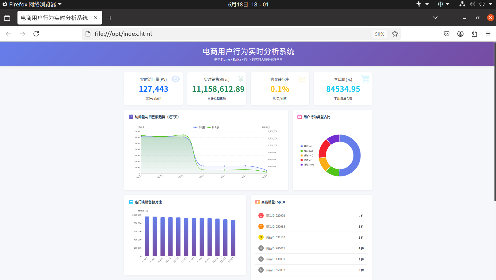

### 1. 核心指标看板
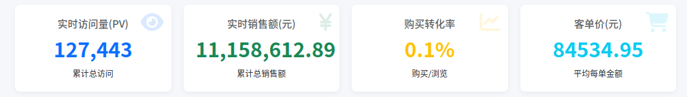
页面顶部展示4个关键业务指标卡片，采用渐变色背景和图标设计：

**实时访问量(PV)**


- 图标：👁️ 眼睛图标（蓝色主题）
- 显示内容：累计总访问次数
- 数据来源：`visitcount_everyday` 表汇总
- 更新频率：每5秒自动刷新

**实时销售额(元)**

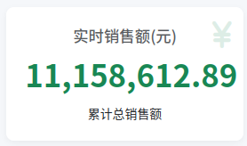
- 图标：💰 人民币符号（绿色主题）
- 显示内容：累计总销售额
- 数据来源：`salevolume` 表汇总
- 更新频率：每5秒自动刷新

**购买转化率**

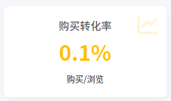
- 图标：📈 趋势图（黄色主题）
- 显示内容：购买行为 / 浏览行为的百分比
- 计算方式：`(购买订单数 / 总PV) × 100%`
- 更新频率：每5秒自动刷新

**客单价(元)**

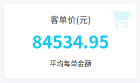
- 图标：🛒 购物车（青色主题）
- 显示内容：平均每单金额
- 计算方式：`总销售额 / 购买订单数`
- 更新频率：每5秒自动刷新

---

### 2. 访问量与销售额趋势图

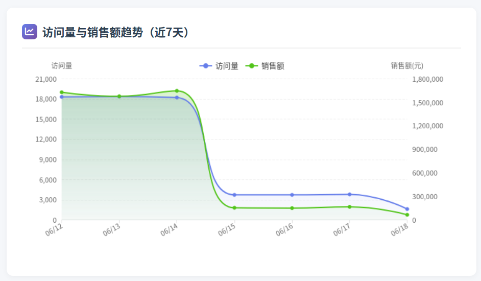

双轴折线图展示近7天的数据变化趋势

**图表特性**：
- **左Y轴**：访问量（紫色渐变区域图）
- **右Y轴**：销售额（绿色渐变区域图）
- **X轴**：日期（格式：MM/DD，如 06/08）
- **时间范围**：最近7天，按日期正序排列

**交互功能**

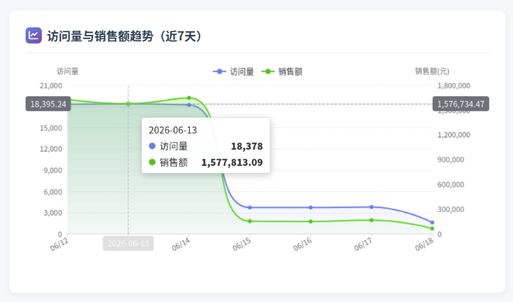
- 鼠标悬停显示具体数值
- 十字准线辅助查看
- 平滑曲线展示趋势
- 渐变色填充区域增强视觉效果

---

### 3. 用户行为占比饼图

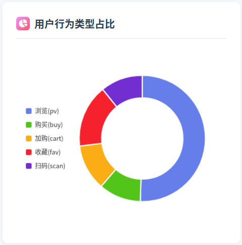

环形饼图展示5种用户行为的分布情况

**行为类型及颜色**：
- 🔵 **浏览(pv)** - 紫色 (#667eea) 
- 🟢 **购买(buy)** - 绿色 (#52c41a) 
- 🟡 **加购(cart)** - 橙色 (#faad14) 
- 🔴 **收藏(fav)** - 红色 (#f5222d) 
- 🟣 **扫码(scan)** - 紫色 (#722ed1)

**图表特性**：
- 环形设计（内径45%，外径70%）
- 图例垂直排列在左侧
- 鼠标悬停高亮显示百分比
- 中心区域可显示总计信息

  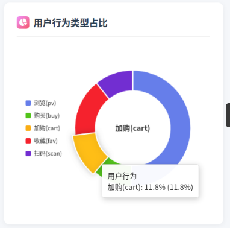

**业务价值**：
- 分析用户购物漏斗转化
- 识别主要流量来源
- 优化商品推荐策略

---

### 4. 各门店销售额柱状图

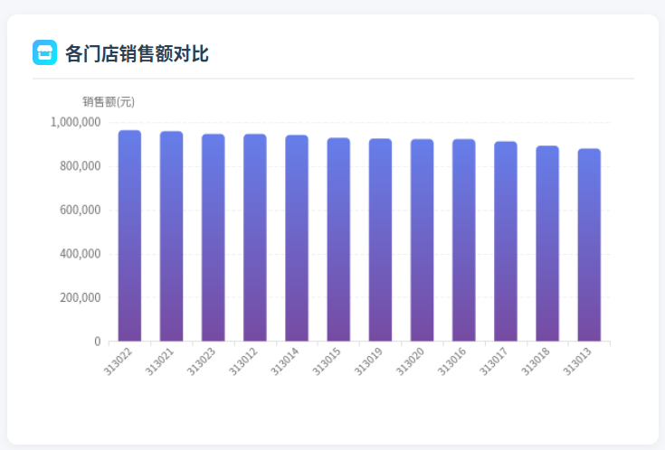

垂直柱状图对比12个门店的销售业绩

**图表特性**：
- **X轴**：门店ID（313012 - 313023）
- **Y轴**：销售额（元）
- **柱子样式**：蓝紫渐变色，圆角顶部
- **排序**：按销售额降序排列
- **标签旋转**：45度避免重叠

**交互效果**

- 鼠标悬停柱子变暗
- 显示具体销售金额
- 支持柱子高亮显示

  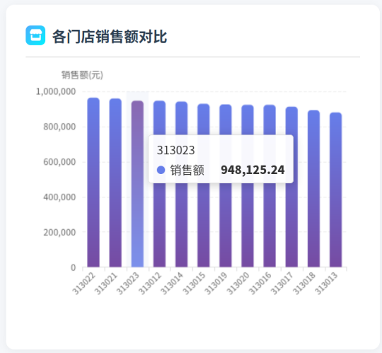

**应用场景**：
- 识别高绩效门店
- 发现销售薄弱环节
- 制定差异化营销策略

---

### 5. 商品销量Top10排行榜

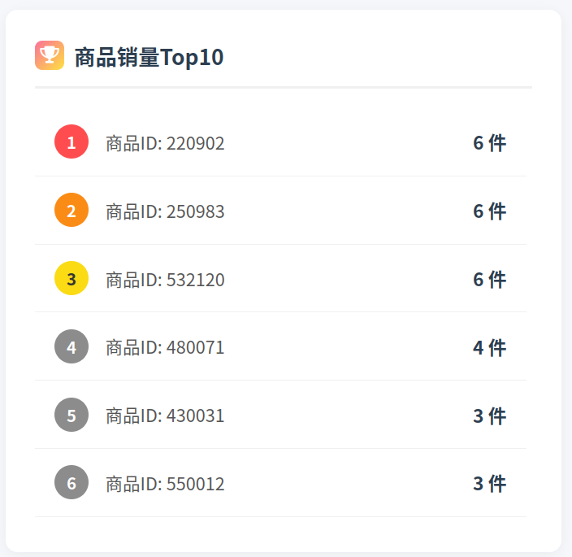
列表形式展示最热销的10个商品

**排名标识**：
- 🥇 **第1名** - 红色圆形徽章 (#ff4d4f)
- 🥈 **第2名** - 橙色圆形徽章 (#fa8c16)
- 🥉 **第3名** - 黄色圆形徽章 (#fadb14)
- **第4-10名** - 灰色圆形徽章 (#8c8c8c)

**显示内容**：
- 商品ID（如：220902, 430031等）
- 销量数值（单位：件）
- 千位分隔符格式化（如：1,234）

**列表特性**：
- 固定高度340px，超出可滚动
- 悬停行背景变色
- 底部边框分隔
- 实时数据更新

---

### 6. 门店访问量Top10排行榜

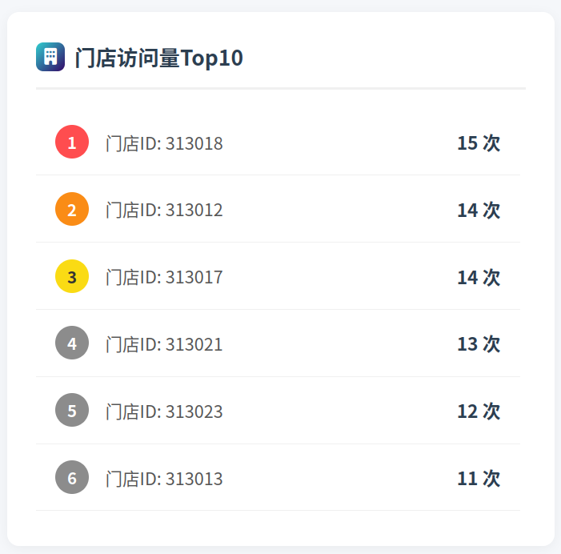
展示最受欢迎的10个门店

**显示内容**：
- 门店ID（如：313012, 313013等）
- 访问次数（单位：次）
- 排名徽章（同商品排行榜）

**与销售额排行对比**：
- 某些门店可能访问量高但销售额低
- 帮助识别潜在转化问题
- 指导门店运营优化

---

### 7. 转化率分析图

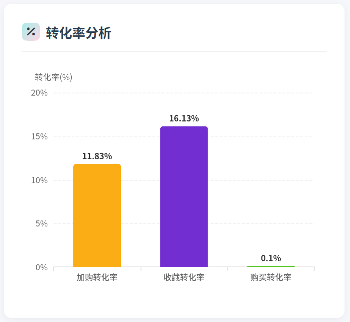
分组柱状图展示三种关键转化率

**转化类型及颜色**：
- 🟡 **加购转化率** - 橙色 (#faad14)
  - 计算公式：`(加购数 / 总行为数) × 100%`

- 🟣 **收藏转化率** - 紫色 (#722ed1)
  - 计算公式：`(收藏数 / 总行为数) × 100%`

- 🟢 **购买转化率** - 绿色 (#52c41a)
  - 计算公式：`(购买数 / 总行为数) × 100%`

**图表特性**：
- Y轴最大值20%，便于对比
- 柱顶显示具体百分比数值
- 渐变色背景区分不同转化率
- 清晰展示转化漏斗效果

**业务洞察**：
- 加购率高但购买率低 → 价格或库存问题
- 收藏率高但加购率低 → 用户观望情绪重
- 整体转化率低 → 需要优化用户体验

---

## 🔧 常见问题

### 1. Kafka 连接失败

**问题**：`Connection refused` 或 `TimeoutException`

**解决**：
- 检查 Kafka 集群是否正常运行
- 确认 `bootstrap.servers` 配置正确
- 检查防火墙和网络连通性
- 验证 hosts 文件配置

### 2. MySQL 连接失败

**问题**：`Access denied` 或 `Communications link failure`

**解决**：
- 检查 MySQL 服务是否启动
- 验证用户名和密码是否正确
- 确认 MySQL 允许远程连接（如需要）
- 检查 JDBC URL 中的时区和 SSL 配置

### 3. Flask 服务无法启动

**问题**：`ModuleNotFoundError` 或端口被占用

**解决**：
```
bash
# 安装缺失的依赖
pip install flask flask-cors pymysql

# 检查端口占用
lsof -i :5000

# 更换端口（修改 app.py 最后一行）
app.run(host='0.0.0.0', port=5001, debug=True)
```
### 4. 前端页面无法加载数据

**问题**：浏览器控制台显示 CORS 错误或网络错误

**解决**：
- 确认 Flask 服务已启动且可访问
- 检查 `index.html` 中的 `BACKEND_URL` 配置是否正确
- 确保浏览器可以访问 Flask 服务的 IP 和端口
- 检查防火墙设置，允许 5000 端口通信

### 5. 数据重复写入

**问题**：MySQL 中出现重复数据

**解决**：
- 确保表中有合适的主键或唯一索引
- 使用 `ON DUPLICATE KEY UPDATE` 语句（已实现）
- 检查 Flink 作业的 checkpoint 配置

### 6. 内存溢出

**问题**：`OutOfMemoryError`

**解决**：
- 增加 Flink TaskManager 内存：`taskmanager.memory.process.size`
- 优化窗口大小，避免窗口过大
- 调整并行度：`-p <parallelism>`

---

## About

**作者**：<a href="https://github.com/kevin402108">Kevin Chan</a>

**Email**：3077384244@qq.com

**项目地址**：<a href="https://github.com/kevin402108/flink_shop">https://github.com/kevin402108/flink_shop.git</a>


